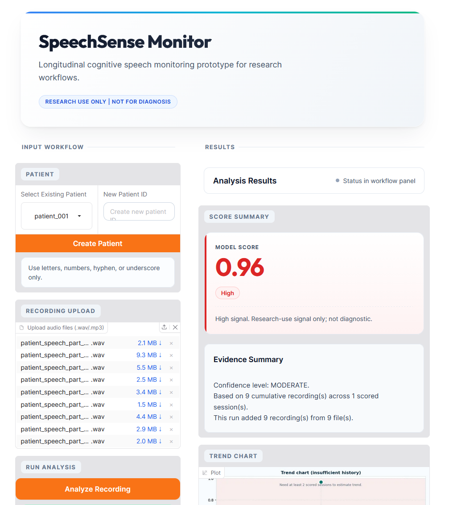
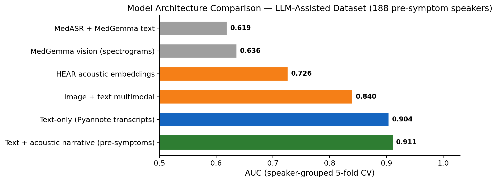
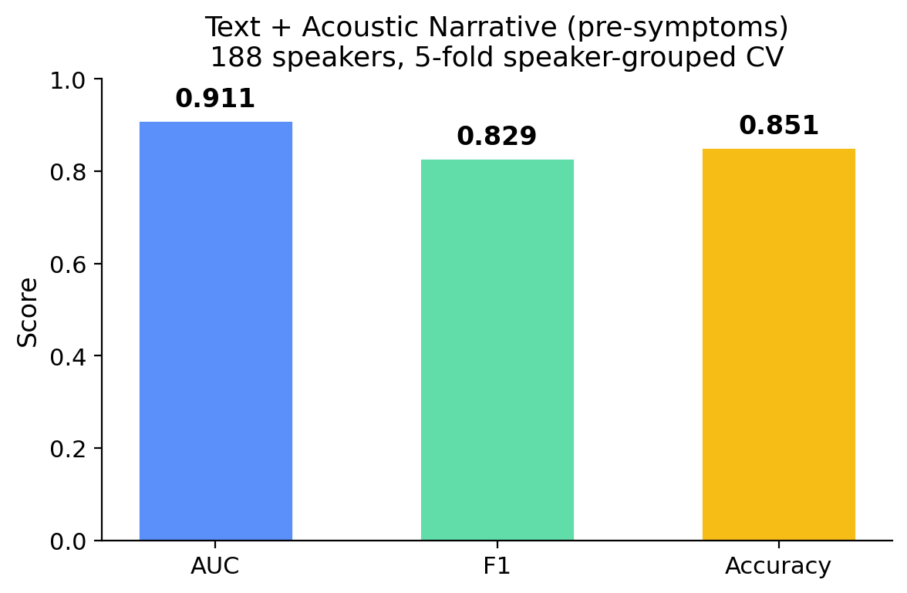
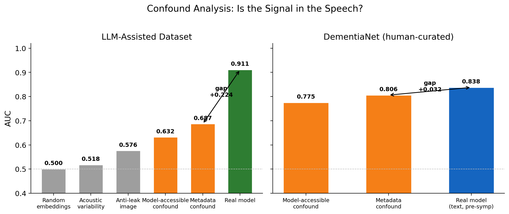
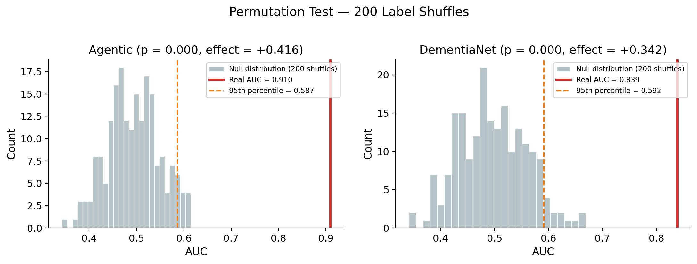
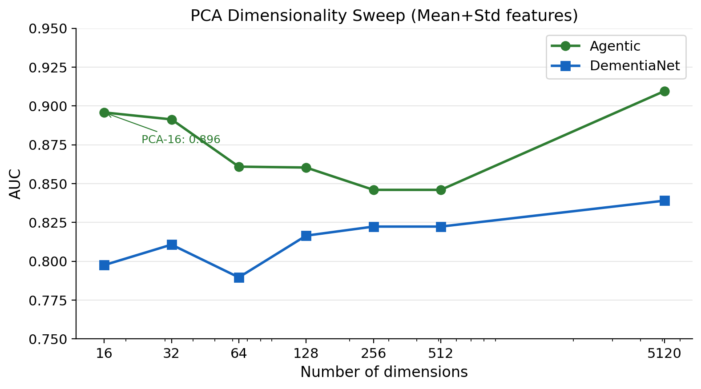
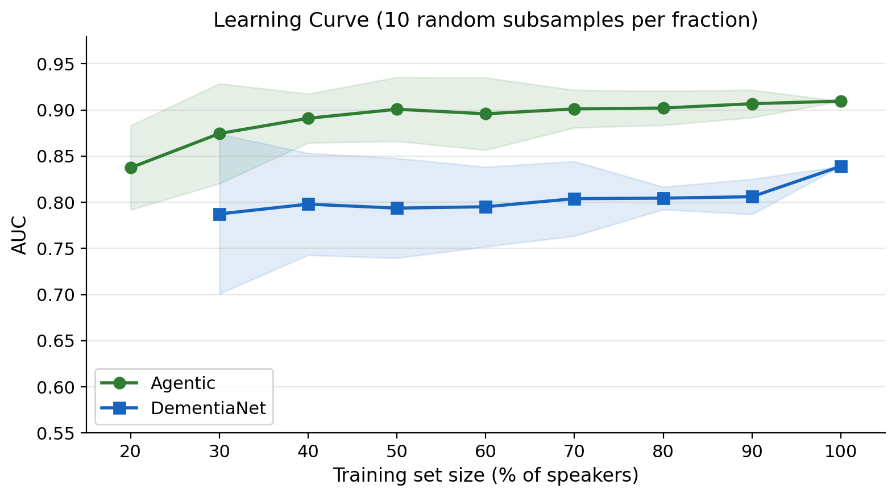
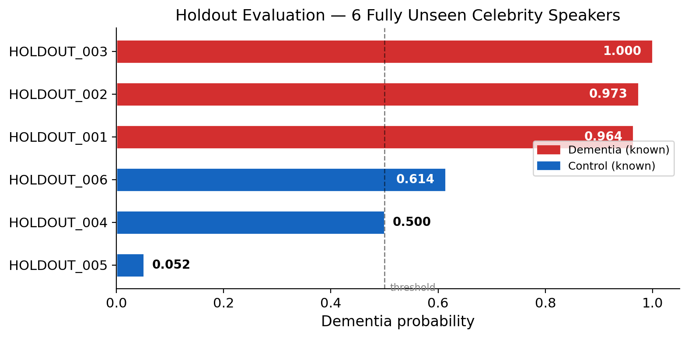

Reliable biomarkers for neurodegenerative diseases have been a subject of continuous scientific interest for decades. Reduced idea density, semantic paraphasia, increased filler usage, and shorter syntactic trees. In the last five years, the question shifted from "does speech carry diagnostic information?" to "can it be extracted reliably, at scale, from real recordings?".

 A number of commercial companies are running initiatives to build such tools.

This repository discusses a prototype system that estimates cognitive risk from natural conversational speech, which is already present in check-in calls and caregiver conversations. It combines linguistic content analysis with acoustic marker profiling to produce a speaker-level risk score that flags individuals who warrant formal cognitive screening.

> **Dataset**: Audio files and holdout data are available on [Google Drive](https://drive.google.com/drive/folders/1FZyK-K_WXL4U28AUTKAjDFpx_QWmV24T?usp=sharing)

## The HAI-DEF models

The release of the HAI-DEF foundation model suite presented an opportunity to test whether health-specific pretrained models could improve speech-based dementia detection compared to general-purpose alternatives.

The suite contains three models with complementary coverage of the speech signal.

 HEAR was pretrained on approximately 300 million bioacoustic clips. Speech prosody, phonation quality, and articulatory precision are bioacoustic signals. This is a direct match for the model's training domain, and substantially more health-relevant pretraining than any general-purpose audio encoder offers.

MedASR was trained on clinical speech and designed to handle disfluencies, atypical patterns, and non-standard articulation common in medical contexts. 

MedGemma is a 4B-parameter vision-language model with medical reasoning capabilities, trained on clinical text and medical imaging.

> **Warning**
>
> This is a detailed description of the project, which involved considerable work, and it includes explanations of my logic and choices. Please feel free to skip to the section of interest! 
>
> The shorter project description is available here: 
>
> [link to the submitted doc]

## The original idea was 

 1. HEAR processes raw audio and extracts acoustic embeddings that encode prosodic and articulatory characteristics. 2. MedASR converts speech to text, preserving the disfluencies and hesitations that general ASR systems typically smooth over. 3. MedGemma receives the transcript and assesses it for clinically documented linguistic markers of cognitive decline: reduced idea density, semantic substitutions, syntactic simplification, and increased filler usage.

Rather than hand-engineering feature extractors for each of these markers, MedGemma's medical language understanding should encode them implicitly in its embedding space.

This was the starting architecture. What happened when it met real data is described in the following sections.

## First, the data problem.

To build a speech-based screening tool, one would need labelled speech data from people with confirmed diagnoses and matched controls. Ideally longitudinal. Ideally diverse in age, accent (or more ideally languages), and recording conditions. With enough speakers to train something generalisable.

Such datasets barely exist.

Having direct experience with this, current datasets of voice recordings for neurodegenerative conditions often struggle with severe class imbalance and highly variable recording parameters. 

DementiaBank's Pitt Corpus is considered one of the main datasets in the field, but it is heavily constrained by demographic and task diversity limitations. Decades of research have relied heavily on a single historical picture description task. 

The dataset from the ADReSSo Challenge is subjectvery strict access limitations. The restricted distribution protocols make the data largely inaccessible to the wider scientific community for independent research.

### DementiaNet initiative

The DementiaNet dataset initiative has a different approach. It consists of speech samples from publicly available interview recordings of individuals whose cognitive status is known from public records. 

84 speakers with confirmed dementia diagnoses, 98 controls, approximately 350 audio segments selected by human curators. The dementia group is labelled by approximate years before diagnosis, providing a coarse longitudinal structure within each speaker.

This way of dataset creation introduces two main issues. 

Subjective judgments about segment quality are influenced by the curator's expectations and are not recorded in the final dataset. 

Manual review of hours of footage per speaker is labour-intensive. For 182 speakers, this is feasible. For thousands, it is not. 

This motivated the development of an automated curation pipeline, that could expand on the DementiaNet initiative. It is described in this repository: 

https://github.com/vitotitto/Speaker_selection_pipeline

## Testing the original idea architecture

The first experiment applied the HAI-DEF pipeline as designed to the LLM-assisted dataset (196 speakers, ~2,800 clips after automated curation, median clip duration ~13 seconds).

HEAR processed raw audio in 2-second windows, extracting acoustic embeddings pooled to speaker level. All classifications used speaker-grouped 5-fold cross-validation. No speaker appeared in both training and test folds.

MedASR transcribed the audio in 20-second chunks. Transcripts were wrapped in a clinical assessment prompt and passed through MedGemma's text encoder. The last hidden layer was mean-pooled across tokens to produce a 2560-dimensional embedding per clip. Speaker-level features were the concatenation of clip-level mean and standard deviation, capturing both the typical speech signature and its variability across segments.

MedASR + MedGemma text embedding produced an AUC of 0.619 (below the acoustic-only baseline). The transcripts were degraded enough that MedGemma's embeddings encoded transcription noise rather than linguistic content.

### The transcript quality finding

Replacing MedASR with higher-quality transcription from a pyannote-derived manifest (LLM-verified) and keeping everything else identical achieved an AUC of 0.895. 

A subsequent run with the final manifest transcripts and optimised prompt wrapping reached 0.904 AUC (text-only, Full LogReg).

### Vision encoder on spectrograms

A control run for the mel spectrograms. Spectrograms rendered as 384×384 images (magma colourmap) and passed through MedGemma's SigLIP vision encoder. Image-only classification achieved 0.636 AUC. Combining image and text embeddings produced 0.840 AUC, which was worse than text-only (0.904). 

This tested if MedGemma's vision pathway could process time-frequency representations of speech, since VLMs are increasingly used for non-standard image modalities. 

### HEAR on the agentic dataset

HEAR acoustic embeddings achieved 0.726 AUC (Full LogReg). 

### Multimodal fusion tests 

Three strategies for combining text and acoustic modalities were tested.

Late fusion with learned weighting (text + HeAR, optimised alpha) reached 0.913 AUC. Feature concatenation of text and HeAR embeddings into a single 9,728-dimensional vector reached 0.917 AUC. This was the highest cross-validation score from any concatenation-based approach.

When tested on 6 fully unseen speakers whose data never entered training or model selection, feature concatenation dropped to 0.667 AUC. 

According to existing data, HeAR embeddings are designed to encode bioacoustic characteristics. In a dataset of ~200 speakers, those characteristics might include speaker identity and not only cognitive markers. The 52:1 feature-to-speaker ratio gave the classifier enough room to learn voice-to-diagnosis mappings. 

### Acoustic and narrative information fusion

Fourteen acoustic descriptors were computed from each audio clip using librosa: speech rate, pause ratio, pitch variability, spectral centroid, harmonics-to-noise ratio, and others. These were embedded as natural language within MedGemma's text prompt alongside the transcript, routing all information through MedGemma's stronger text pathway rather than forcing acoustic data through the vision encoder.

This achieved 0.921 AUC on the full dataset. After excluding post-symptom recordings (clips made at or after diagnosis), it reached 0.911 AUC on 188 speakers and 2,571 pre-symptomatic clips. This is the final model.

The modest but consistent improvement from adding acoustic descriptors as text was 0.904 to 0.921. More importantly, it was the first successful second-modality integration after the vision encoder and direct feature concatenation both failed or did not generalise.

### Automated curation importance

A metadata confound analysis tested whether non-speech information (clip count per speaker, mean duration, duration variability) could predict diagnosis. On the DementiaNet human-curated dataset, metadata alone achieved an AUC of 0.806, exceeding the real model's 0.794. The model cannot be distinguished from one that learned selection artefacts rather than speech content.

On the LLM-assisted dataset, metadata confound classification reached an AUC of 0.687. The real model reached 0.911. A gap of 0.224 between confound and model. The signal is in the speech, not in the selection.

Human curators, who know the speakers and their diagnoses, might introduce correlations between how they select segments and the diagnostic label. 

The automated curation is more scalable, but it is also more likely to achieve cleaner experimental conditions when carefully set up.

### Confound tests

Throughout all experiments, systematic controls were introduced to check the signal source.

Random embeddings replacing MedGemma output produced ~0.50 AUC, confirming the classifier depends on actual embedding content. 

Acoustic variability features alone (spectral statistics without linguistic content) produced 0.518 AUC. Image-based anti-leakage tests reached 0.576 AUC. All near chance.

Excluding post-symptom recordings reduced text-based model AUC by 0.006 to 0.013. This confirms the classifier detects pre-diagnostic markers, not obvious post-diagnosis impairment. HEAR standalone actually improved after exclusion (+0.032), suggesting post-symptom clips added voice-fingerprint noise to acoustic features.

Cross-validation stability was assessed using StratifiedGroupKFold across multiple seeds to verify that results were not artefacts of a single favourable fold split.

### Robustness analysis

The final model operates on 5,120-dimensional speaker-level features (mean and standard deviation of 2,560-dimensional MedGemma embeddings) with 188 speakers. This is a high-dimensional setting. Several analyses were conducted to determine whether the observed 0.911 AUC reflects genuine signal or statistical artefact.

**Permutation testing.** Speaker labels were shuffled 200 times and the full pipeline re-evaluated. No permutation achieved an AUC above 0.614. The observed AUC of 0.911 exceeds the permutation distribution by +0.416 (p=0.000). On DementiaNet the effect was +0.342 (p=0.000). The signal is statistically significant on both datasets.

**Mean+standard deviation versus mean-only.** Removing the standard deviation component (reducing features from 5,120 to 2,560 dimensions) dropped AUC from 0.910 to 0.861 on the agentic dataset and from 0.839 to 0.820 on DementiaNet. The standard deviation of embeddings across clips encodes within-speaker variability. This variability carries diagnostic information independent of mean speech characteristics.

**Dimensionality reduction.** PCA was applied at multiple thresholds. At PCA-16 (16 components from 5,120 features), the agentic dataset retained 0.896 AUC. A drop of 0.014 from full dimensionality. The diagnostic signal concentrates in a small number of principal components. At PCA-16 with mean-only features, AUC was 0.853. The core separation between groups survives aggressive compression.

DementiaNet showed a similar pattern. PCA-16 achieved 0.798 AUC versus 0.839 at full dimensionality.

**Regularisation sensitivity.** The logistic regression C parameter was swept across values. AUC ranged from 0.907 to 0.911 on the agentic dataset and 0.828 to 0.841 on DementiaNet. Performance is flat. The classifier is not exploiting a narrow regularisation regime.

**Learning curve.** The training set size was varied from 10% to 100% of speakers. On the agentic dataset, AUC plateaued at approximately 50% of speakers (~94). Additional training data produced negligible improvement. On DementiaNet, the AUC continued to rise at 100% of available speakers. The agentic dataset is sufficient for the current approach. DementiaNet is data-limited.

**Post-symptom exclusion.** Removing recordings made at or after diagnosis reduced AUC by 0.010 (0.921 to 0.911). HEAR standalone improved by 0.032 after the same exclusion. The text-based model detects pre-diagnostic speech changes. The acoustic model was partially encoding post-diagnosis vocal deterioration.

## Holdout evaluation

Six celebrity speakers were held out from training. 

At n=6, the holdout is underpowered for reliable AUC estimation. It is reported as a directional check only (not a performance metric).

Feature concatenation of text and HeAR embeddings achieved 0.667 AUC on holdout despite 0.917 in cross-validation. 

The HeAR component encoded speaker voice identity rather than cognitive markers. Feature concatenation of text and HeAR embeddings confirmed the failure mode described above: 0.667 AUC on the holdout set. 

Text-only and text with acoustic narrative models maintained directional accuracy. The acoustic narrative model correctly classified 5 of 6 speakers with a conservative bias toward control predictions. All three dementia speakers were identified with high confidence (0.964,  0.973,  0.9985). Two of three controls were correctly classified ( 0.052,  0.502). Another person was misclassified, a marginal false positive at 0.614. Discrimination was perfect (AUC 1.0 across 6 speakers): every dementia case ranked higher than every control (threshold calibration). 

Note: the video demonstration incorrectly states 6 of 6. The correct figure is 5 of 6. 

A larger holdout evaluation with properly validated speakers is needed before any performance claims beyond cross-validation can be made.

---

## Product feasibility

A single probability score from a single conversation rarely represents the whole picture. Cognitive performance fluctuates, and this system is designed to measure the trajectory over time.

Every recorded interaction passes through the pipeline, selecting the best and longest patient speech samples. Month by month, a curve of the patient's linguistic and acoustic state can be constructed.

A progressive rise in the risk score over 12 months can be used as a valid longitudinal data point for the clinician to administer screening or a blood test. 

The production pipeline requires only MedASR and MedGemma 4B, no HeAR model loading needed. Acoustic features are calculated using lightweight librosa signal processing, reducing GPU memory and inference time. MedGemma runs on consumer-grade hardware with 4-bit quantisation (demonstrated on NVIDIA RTX 3080, 10 GB VRAM). On-device inference preserves patient privacy. No audio leaves the local environment in case of MedASR usage or switching to the Pyannote community model. 

The baseline reality is that 75% of dementia cases globally are missed. In the UK, patients aged 65 and over have roughly 11 million GP consultations each year. If a passive background layer flags just 5% of those for review, the system creates 500,000 early triage opportunities. The cost of this is low.

---

## Discussion

MedGemma's text embeddings separate dementia from control speakers at 0.911 AUC without fine-tuning. The model was not trained for this task. Its medical-language understanding, developed on clinical texts and medical reasoning, encodes features of speech transcripts that correlate with cognitive decline. 

The transcript quality ablation is the study's most practically significant finding. The 0.619 to 0.895 AUC gap with identical downstream architecture exceeds the effect of any model change, fusion strategy, or classifier choice tested. 

The acoustic narrative approach resolves a practical problem with medical vision-language models. Without fine-tuning, MedGemma's vision encoder does not transfer to time-frequency representations. The encoder was trained on radiology and pathology images, which share no structural similarity with mel spectrograms. 

Fine-tuning the vision encoder on speech spectrograms is a possible future direction, though it would require substantially more labelled data than was available for this study. 

That being said, converting acoustic measurements to descriptive text routes this information through the model's stronger pathway. The approach is not specific to dementia or speech. Any domain with numerical sensor data (wearables, physiological monitoring, lab results) could use the same strategy to leverage medical VLMs on non-standard modalities.

Inter-session variability carries diagnostic information. The standard deviation of embeddings across a speaker's clips contributed a +0.048 AUC improvement over mean-only features on the agentic dataset. How much someone's speech varies across recordings is diagnostically informative independent of their average speech characteristics. This supports longitudinal monitoring over single-session assessment.

## Limitations

The dataset has fewer than 200 speakers. For clinical machine learning, this is a tiny fracture of reality. Every speaker is a public figure. They do not represent the general population. People speak differently in broadcast interviews than they do in a clinic or a kitchen.

All the results come from cross-validation. These have not been tested against independent populations, different languages, or new recording environments. 

MedGemma is used as a frozen feature extractor. Fine-tuning it on actual clinical speech would likely yield better results. This study did not have the timeline or the volume of data to do that here.

The pipeline relies heavily on high-quality transcription from Pyannote. Switching to MedASR reduces the AUC to 0.619. MedASR was built for clinical contexts, but it struggled with naturalistic interview speech. The strongest results require an alternative backend. It is a known limitation, and if deployed, monitoring of speech parts and transcript quality is mandatory.

Age is a known confound. The effect sizes in the control group are small and not statistically significant. The age distribution in the data is imperfect. An ageing brain changes how a person speaks, entirely independently of cognitive decline.

The risk thresholds are uncalibrated. The traffic-light categories in the prototype serve only to illustrate the concept. Real deployment requires more data, prospective validation against formal cognitive tests, strict regulatory review, and deep bias testing across demographics.

## Appendix. DementiaNet dataset analysis

DementiaNet (182 speakers, 354 clips; 167 speakers and ~315 clips after excluding post-symptom recordings) served as the initial development dataset. Results are reported here separately because a metadata confound limits their interpretability.

**Acoustic baselines.** HEAR frozen embeddings achieved 0.748 AUC (SVM-RBF) at speaker level. MiniRocket on mel spectrograms achieved 0.770 AUC (LogReg, PCA-128). MedGemma's vision encoder on spectrograms rendered as images achieved 0.730 AUC (GBM). Three independent methods with no shared training history converged in the 0.70–0.77 range. This convergence suggests the acoustic signal in the data is real and characterises an approximate ceiling for acoustic-only classification.

**Frequency band ablation.** ROCKET was applied to restricted frequency ranges of the mel spectrogram. Prosodic frequencies (0–1 kHz) and articulatory frequencies (1–4 kHz) both carried diagnostic signal. High-frequency bands (4+ kHz) contributed least. This distribution is consistent with speech rhythm and articulation patterns rather than recording-quality artefacts.

**Text embeddings.** MedGemma text embeddings from pyannote transcripts achieved 0.792 AUC (Full LogReg) and 0.794 (Full GBM). Text outperformed all acoustic-only approaches.

**Multimodal.** MedGemma image+text achieved 0.788 AUC (GBM). Late fusion of HEAR and text embeddings via stacking achieved 0.793 AUC. Neither multimodal approach substantially improved over text-only on this dataset.

**Pre-symptoms re-run.** All conditions were re-evaluated after excluding 27 post-symptom clips from 10 speakers. Most conditions improved. MedGemma text rose from 0.792 to 0.838. HEAR rose from 0.748 to 0.773 (Full LogReg: 0.791). MedGemma vision rose from 0.730 to 0.804. The post-symptom clips were adding noise rather than signal for most approaches.

| Condition | All data AUC | Pre-symptoms AUC | Delta |
|-----------|-------------|-----------------|-------|
| HEAR (SVM-RBF / Full LogReg) | 0.748 / 0.729 | 0.773 / 0.791 | +0.025 / +0.062 |
| MiniRocket | 0.770 | 0.743 | −0.027 |
| MedGemma text (Full LogReg) | 0.792 | 0.838 | +0.046 |
| MedGemma vision (GBM) | 0.730 | 0.804 | +0.074 |
| MedGemma image+text (GBM) | 0.788 | 0.815 | +0.027 |

**Metadata confound.** A classifier trained on metadata features only (clip count per speaker, mean duration, duration variability) achieved 0.806 AUC on DementiaNet. This exceeds the real text model (0.794). On the agentic dataset, the same metadata classifier achieved an AUC of 0.687, compared with a final model's performance of 0.911.

On DementiaNet, a classifier cannot be distinguished from one that learned selection artefacts. Human curators who know speaker identities and diagnoses introduced systematic correlations between segment selection patterns and diagnostic labels. More clips or longer clips for one group. Different quality thresholds applied unconsciously. These patterns are invisible in the final dataset but learnable.

The vision encoder results on DementiaNet are particularly affected. Image-only AUC of 0.804 (pre-symptoms, GBM) with ±0.089 standard deviation across folds sits at the metadata confound ceiling. Fold-level AUCs ranged from 0.688 to 0.898. This instability is characteristic of confound-driven classification: performance depends on whether the confound aligns with the fold split, not on acoustic content.

The agentic pipeline, blind to diagnosis during segment selection, produces a 0.224 gap between metadata confound (0.687) and real model (0.911). DementiaNet results are reported for completeness but the agentic dataset provides the trustworthy evaluation.

### Dataset comparison

| Property | DementiaNet | LLM-assisted |
|----------|-------------|-------------|
| Speakers | 182 (84 dementia, 98 control) | 196 (92 dementia, 104 control) |
| Clips (pre-symptoms) | ~315 | 2,571 |
| Median clip duration | ~53s | ~13s |
| Median clips per speaker | ~2 | ~14 |
| Curation method | Human review | Automated pipeline |
| Metadata confound AUC | 0.806 | 0.687 |
| Best text model AUC | 0.838 | 0.911 |
| Model − confound gap | 0.032 | 0.224 |
